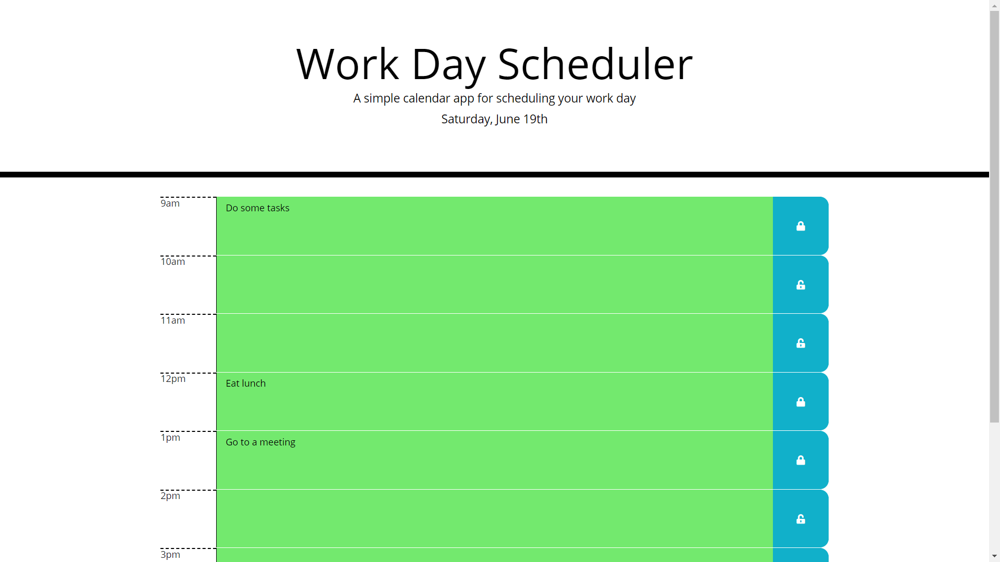

# WorkDayScheduler

A simple application that can be used to set a daily work schedule.

I had less time for this project than I would have liked the the code is therefore in my opinion not optimal or as good as I could have written it.

That being said, it functions and I got it done and that is always positive.

### Can be viewed here:

https://derek-watson14.github.io/WorkDayScheduler/

### Screenshot:

